<p align="center">
  
</p>

<div align="center">

[](https://python.org)
[](https://reactjs.org)
[](https://nodejs.org)
[](https://firebase.google.com)
[](LICENSE)

<br/>

**Transform $20 into $400/day** through ML-powered statistical arbitrage on Kalshi prediction markets

[Quick Start](#-quick-start) &bull; [Features](#-key-features) &bull; [Architecture](#-architecture) &bull; [Documentation](#-documentation) &bull; [Roadmap](#-roadmap)

</div>

---

## 🎯 What is Klashibot?

Klashibot is an **intelligent automated trading system** designed for Kalshi prediction markets. It combines cutting-edge machine learning with conservative risk management to identify and exploit probability mispricings in real-time.

<div align="center">
  <table>
    <tr>
      <td align="center">
        
        <br/><b>ML-Powered</b><br/>
        <sub>Ensemble models predict<br/>market probabilities</sub>
      </td>
      <td align="center">
        
        <br/><b>Risk-First</b><br/>
        <sub>Conservative limits<br/>protect your capital</sub>
      </td>
      <td align="center">
        
        <br/><b>Kelly Criterion</b><br/>
        <sub>Mathematically optimal<br/>position sizing</sub>
      </td>
      <td align="center">
        
        <br/><b>Real-Time</b><br/>
        <sub>WebSocket feeds<br/>for instant data</sub>
      </td>
    </tr>
  </table>
</div>

---

## 🚀 The Journey: $20 to $400/day

Klashibot implements a **5-phase growth strategy** designed to scale from minimal capital to sustainable daily income:

```mermaid
graph LR
    A[Phase 1<br/>$20-$50<br/>🌱 Micro Start] --> B[Phase 2<br/>$50-$200<br/>📈 Small Scale]
    B --> C[Phase 3<br/>$200-$1K<br/>💪 Medium Scale]
    C --> D[Phase 4<br/>$1K-$5K<br/>🔥 Large Scale]
    D --> E[Phase 5<br/>$5K+<br/>🎯 Target: $400/day]

    style A fill:#E3F2FD
    style B fill:#BBDEFB
    style C fill:#90CAF9
    style D fill:#64B5F6
    style E fill:#42A5F5
```



| Phase | Capital | Position Size | Daily Positions | Risk Level |
|-------|---------|--------------|-----------------|------------|
| **Micro Start** | $20 - $50 | 1-2 shares | 2-3 | Ultra Conservative |
| **Small Scale** | $50 - $200 | 2-5 shares | 3-5 | Conservative |
| **Medium Scale** | $200 - $1K | 5-10 shares | 5-10 | Moderate |
| **Large Scale** | $1K - $5K | 10-25 shares | 10-15 | Balanced |
| **Target Scale** | $5K+ | 25+ shares | 15+ | Growth |

---

## ✨ Key Features

<details>
<summary><b>🧠 Machine Learning Engine</b></summary>
<br/>

- **Ensemble Predictions**: Combines Logistic Regression, Random Forest, and XGBoost
- **20+ Technical Indicators**: Advanced feature engineering including:
  - Price momentum (5, 20, 60 periods)
  - Volume-weighted metrics
  - Bid-ask spread analysis
  - Market microstructure features
  - Temporal patterns
  - Cross-market correlations
- **Probability Delta Analysis**: Identifies opportunities where model prediction differs from market implied probability
- **Continuous Learning**: Models retrain on new market data

</details>

<details>
<summary><b>🛡️ Risk Management System</b></summary>
<br/>

- **Daily Loss Limits**: $2.00 max daily loss (10% for $20 account)
- **Position Limits**: Max 5 shares per position to start
- **Portfolio Exposure**: Maximum 10% total portfolio risk
- **Cash Reserve**: Maintains $2.00 safety buffer
- **Correlation Tracking**: Avoids concentrated bets
- **Auto-Halt**: Stops trading when limits reached
- **24hr Position Timeout**: Auto-closes stale positions

</details>

<details>
<summary><b>💳 Automated Transfers</b></summary>
<br/>

- **ACH Bank Transfers**: Secure Plaid + Dwolla integration
- **PayPal Support**: Backup transfer method
- **Daily Income Extraction**: Auto-transfer profits to bank
- **Idempotent Operations**: UUID-based deduplication
- **Firebase Security**: No raw bank details stored
- **Webhook Updates**: Real-time transfer status

</details>

<details>
<summary><b>📊 Real-Time Dashboard</b></summary>
<br/>

- **Portfolio Monitoring**: Live value and P&L tracking
- **Position Management**: Active and closed positions table
- **Performance Charts**: 7-day visual analytics
- **Risk Controls**: Real-time limit monitoring
- **Toast Notifications**: Alert system for critical events
- **Dark Theme**: Optimized for trading focus

</details>

<details>
<summary><b>⚙️ Trading Profiles</b></summary>
<br/>

Pre-configured strategies for different risk appetites:

| Profile | Min Edge | Kelly Base | Min Confidence | Best For |
|---------|----------|------------|----------------|----------|
| **Conservative** | 5% | 3% | 65% | Capital preservation |
| **Balanced** | 2% | 5% | 55% | Default growth |
| **Aggressive** | 1% | 8% | 52% | Fast scaling |
| **Scalping** | 0.5% | 2% | 51% | High frequency |
| **Value** | 8% | 10% | 70% | High conviction |

</details>

---

## 🏗️ Architecture

```
klashibot/
├── 🐍 Backend (Python)
│   ├── src/
│   │   ├── main.py              # Bot orchestrator
│   │   ├── kalshi_client.py     # API client (REST + WebSocket)
│   │   ├── strategy.py          # Kelly criterion & signals
│   │   ├── models.py            # ML ensemble framework
│   │   ├── risk_manager.py      # Risk control system
│   │   ├── execution.py         # Order management
│   │   ├── feature_engineering.py # 20+ technical indicators
│   │   └── monitoring.py        # Performance tracking
│   └── requirements.txt         # 30+ Python packages
│
├── ⚛️ Frontend (React)
│   └── frontend/
│       ├── src/BotDashboard.jsx # Real-time dashboard
│       └── package.json         # React 18 + Firebase
│
├── 💰 ACH Microservice (Node.js)
│   └── src/
│       ├── ach_manager.js       # Plaid + Dwolla integration
│       └── package.json         # Express + Firebase Admin
│
├── ⚙️ Configuration
│   ├── config/threshold_profiles.json
│   └── config.env.example
│
└── 📚 Documentation
    ├── README.md
    ├── QUICKSTART.md
    ├── CHANGELOG.md
    └── ROADMAP.md
```

---

## 🛠️ Tech Stack

<p align="center">
  
</p>

<div align="center">

| Category | Technologies |
|----------|-------------|
| **ML/Data** |     |
| **Backend** |     |
| **Frontend** |    |
| **Payments** |    |
| **Testing** |   |

</div>

---

## ⚡ Quick Start

### Prerequisites

- **Python 3.8+**
- **Node.js 16+** (for ACH service)
- **Kalshi Account** with API access
- **Firebase Project** with Firestore enabled

### Installation

```bash
# 1. Clone the repository
git clone https://github.com/Snapwave333/klashibot.git
cd klashibot

# 2. Install Python dependencies
pip install -r requirements.txt

# 3. Run setup wizard
python setup.py

# 4. Configure API credentials
python setup_credentials.py
```

### Configuration

Create `.env` file from template:

```bash
cp config.env.example .env
```

Essential configuration:

```env
# Kalshi API
KALSHI_API_KEY=your_api_key
KALSHI_PRIVATE_KEY=kalshi_private_key.pem

# Trading Parameters
STARTING_BALANCE=20.0
DEFAULT_KELLY_FRACTION=0.05
MIN_PROBABILITY_DELTA=0.02

# Risk Management
MAX_DAILY_LOSS=2.0
MAX_PORTFOLIO_RISK=0.1
MAX_POSITION_SIZE=5
```

### Launch

```bash
# Start trading bot
python cli.py trade --tickers TRUMP2024 ELECTION2024 --interval 300

# Or use the launcher
python launch_real.py
```

### Dashboard

```bash
cd frontend
npm install
npm start
```

Visit `http://localhost:3000` to view real-time dashboard.

---

## 📊 How It Works


### Trading Logic

1. **Data Collection**: WebSocket streams real-time market data
2. **Feature Engineering**: Computes 20+ technical indicators
3. **ML Prediction**: Ensemble models predict true probability
4. **Signal Generation**: Identifies when model P ≠ market P
5. **Position Sizing**: Kelly Criterion determines optimal size
6. **Risk Check**: Validates against all risk limits
7. **Execution**: Places limit orders with slippage control
8. **Monitoring**: Tracks P&L and adjusts strategy

---

## 📈 Performance Monitoring

The bot provides comprehensive monitoring through:

- **Structured Logging**: JSON logs with performance metrics
- **Real-time Dashboard**: Firebase-synced React UI
- **Model Performance**: Tracks prediction accuracy over time
- **Risk Analytics**: Monitors exposure and correlation
- **Daily Reports**: Summarizes P&L, trades, and edge

---

## 📚 Documentation

| Document | Description |
|----------|-------------|
| [**QUICKSTART.md**](QUICKSTART.md) | Get running in 5 minutes |
| [**ROADMAP.md**](ROADMAP.md) | Future development plans |
| [**CHANGELOG.md**](CHANGELOG.md) | Version history |
| [**IMPLEMENTATION_SUMMARY.md**](IMPLEMENTATION_SUMMARY.md) | Technical deep-dive |
| [**src/ACH_SETUP.md**](src/ACH_SETUP.md) | Bank transfer configuration |
| [**frontend/README.md**](frontend/README.md) | Dashboard documentation |

---

## 🗺️ Roadmap

- [x] Core trading engine
- [x] ML ensemble models
- [x] Risk management system
- [x] Real-time WebSocket integration
- [x] React dashboard
- [x] ACH/PayPal transfers
- [x] 5-phase growth strategy
- [ ] Advanced backtesting framework
- [ ] Multi-market correlation trading
- [ ] Mobile app dashboard
- [ ] Telegram/Discord alerts
- [ ] API rate limit optimization
- [ ] Cloud deployment (AWS/GCP)

---

## ⚠️ Disclaimer

**Trading involves substantial risk of loss.** This bot is provided for educational and research purposes. Past performance does not guarantee future results. Never trade with money you cannot afford to lose.

- **Not Financial Advice**: This is an automated trading tool, not investment advice
- **Use at Your Own Risk**: The authors are not responsible for any losses
- **Paper Trade First**: Test extensively in sandbox environment
- **Understand the Code**: Review all logic before running with real money

---

## 🤝 Contributing

Contributions are welcome! Please:

1. Fork the repository
2. Create a feature branch (`git checkout -b feature/amazing-feature`)
3. Commit changes (`git commit -m 'Add amazing feature'`)
4. Push to branch (`git push origin feature/amazing-feature`)
5. Open a Pull Request

See [CONTRIBUTING.md](CONTRIBUTING.md) for detailed guidelines.

---

## 📄 License

This project is licensed under the MIT License - see the [LICENSE](LICENSE) file for details.

---

## 🙏 Acknowledgments

- [Kalshi](https://kalshi.com) for the prediction market platform
- [scikit-learn](https://scikit-learn.org) for ML algorithms
- [Firebase](https://firebase.google.com) for real-time database
- [Plaid](https://plaid.com) & [Dwolla](https://dwolla.com) for payment infrastructure

---

<p align="center">
  
</p>

<div align="center">

**Built with ❤️ for the future of prediction markets**

<a href="https://github.com/Snapwave333/klashibot">
  
</a>

</div>
