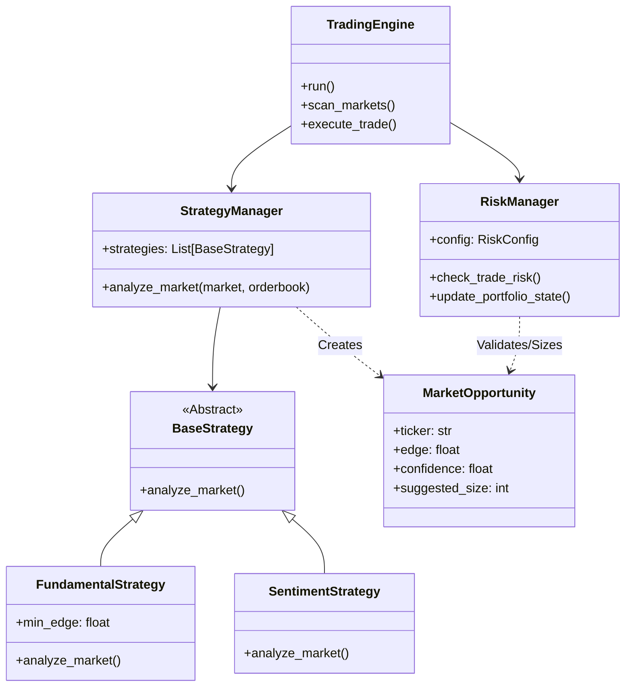

# System Architecture

## Overview
The Kalshi AI Trading Agent is designed as a modular, event-driven system optimized for high-frequency analysis and execution in prediction markets. It separates concerns between market scanning, strategy execution, risk management, and order routing.

## 1. High-Level Architecture

```mermaid
graph TD
    MarketData[Kalshi API / MCP] -->|Market & Orderbook| Engine[Trading Engine]
    
    subgraph "Core Trading Logic"
        Engine -->|Market Data| StratMgr[Strategy Manager]
        StratMgr -->|Analyze| StratFund[Fundamental Strategy]
        StratMgr -->|Analyze| StratSent[Sentiment Strategy]
        
        StratFund -->|Signal| StratMgr
        StratSent -->|Signal| StratMgr
        
        StratMgr -->|Opportunities| Engine
    end
    
    subgraph "Risk Control"
        Engine -->|Candidate Trade| RiskMgr[Risk Manager]
        RiskMgr -->|Check Limits| Limits[Circuit Breakers]
        RiskMgr -->|Check Correlation| Correlation[Correlation Filter]
        RiskMgr -->|Calculate Size| Kelly[Kelly Criterion]
        
        RiskMgr -->|Approved Size| Engine
    end
    
    subgraph "Execution"
        Engine -->|Order| Execution[Execution Module]
        Execution -->|Submit| MCP[MCP Server]
        MCP -->|Order| Kalshi[Kalshi Exchange]
    end
    
    Engine -->|Updates| Brian[Brian Interface]
    Brian -->|Logs & Alerts| Dashboard[WebSocket Dashboard]
```

## 2. Class Structure



## 3. Data Flow

1.  **Ingestion**: `TradingEngine` polls `scan_markets_parallel` to fetch active markets and their orderbooks via MCP.
2.  **Analysis**: 
    *   Market data is passed to `StrategyManager`.
    *   `StrategyManager` delegates to all active strategies (`Fundamental`, `Sentiment`).
    *   Strategies return `MarketOpportunity` objects if conditions are met (e.g., Edge > Threshold).
3.  **Risk Assessment**:
    *   Candidate opportunities are passed to `RiskManager`.
    *   `RiskManager` checks:
        *   Global Circuit Breakers (Daily Loss, Max Drawdown).
        *   Correlation limits (preventing over-concentration in one sector).
        *   Position Sizing (Kelly Criterion based on edge/confidence).
    *   If valid, `suggested_size` is updated. If rejected, size is 0.
4.  **Execution**:
    *   Approved opportunities are sent to `execute_trade_fast`.
    *   Price is adjusted for estimated impact.
    *   Order is submitted via MCP `create_order`.
5.  **Feedback**:
    *   Trade result (Success/Fail/Slippage) is logged.
    *   "Brian" Interface broadcasts formatted logs to the UI.
    *   `RiskManager` updates internal portfolio state.

## 4. Key Technologies
*   **Python 3.10+**: Core language.
*   **Asyncio**: High-concurrency event loop.
*   **Orjson**: High-performance JSON parsing.
*   **Pytest**: Testing framework.
*   **Mermaid**: Diagramming.
