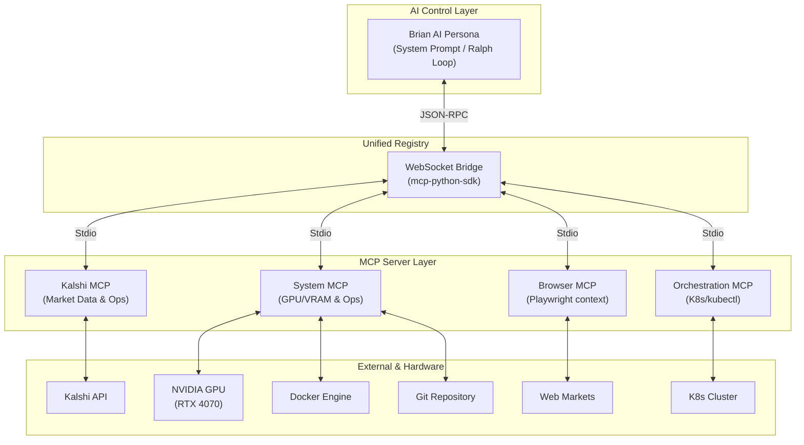

# MCP Server Ecosystem Architecture

The Kalashi Trading System utilizes a **Unified Multi-MCP Bridge** to orchestrate interactions between the Brian AI Persona and specialized tool servers.

## 📊 System Overview

## 🛠️ Integrated Tools

| Server | Primary Responsibility | Key Tools |
| :--- | :--- | :--- |
| **Kalshi** | Market Execution | `create_order`, `get_markets`, `fetch_rss_feed` |
| **System** | Hardware & Ops | `get_gpu_stats`, `git_operations`, `docker_manager`, `play_profit_chime` |
| **Browser** | Deep Research | `browse_and_extract` |
| **Orchestration** | Scaling | `k8s_manager` |

## 🔄 Execution Flow (Ralph Loop)

1. **Observe**: Bridge polls `System.get_gpu_stats` and `Kalshi.get_markets`.
2. **Plan**: Agent reasons via `DeepSeek-R1` if edge > 0.
3. **Build**: Execution via `Kalshi.create_order` and feedback via `System.play_profit_chime`.
