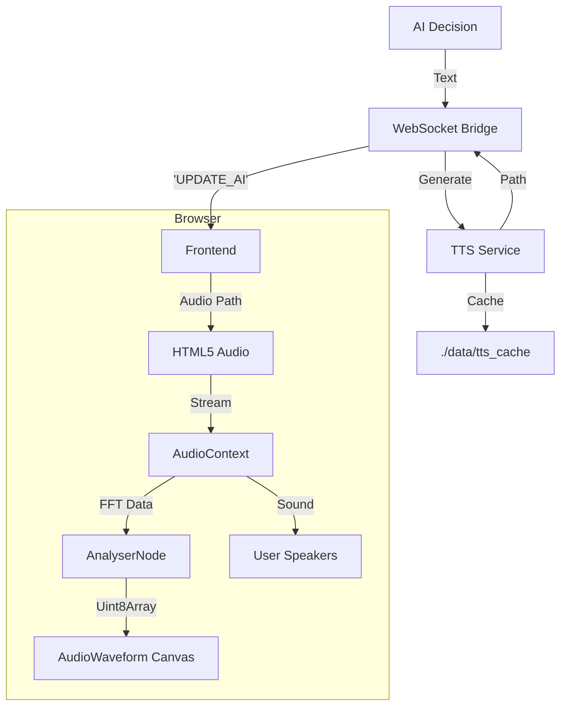

# TTS (Text-to-Speech) & Audio Architecture

**Date:** 2026-01-21
**Version:** 3.2.0
**Status:** ✅ COMPLETE

---

## Overview

The Kalshi Trading Bot now features a complete **Audio Feedback System**, combining neural text-to-speech (TTS) with real-time frequency visualization. This system allows the AI to communicate verbally while providing visual feedback through a dynamic waveform display, creating a futuristic "Iron Man" style interface.

---

## Core Components

### 1. **Backend TTS Service** (`tts_service.py`)

**Location:** `tts_service.py`

**Capabilities:**
- **Multiple Backends:** Coqui TTS (Neural), pyttsx3 (Offline), gTTS (Cloud).
- **Smart Caching:** MD5 hash-based caching for instant playback of repeated phrases.
- **Alert Levels:** Distinct handling for `info`, `success`, `warning`, and `critical` alerts.
- **HTTP Server:** Dedicated `aiohttp` server on port **8767** for serving audio files.

### 2. **Audio Visualization System** (NEW)

**Location:** `frontend/src/context/AudioContext.tsx` & `frontend/src/components/ui/AudioWaveform.tsx`

The visualization system uses the Web Audio API to analyze audio frequencies in real-time.

**Architecture:**
1. **AudioContext:** Creates a global audio processing graph.
2. **AnalyserNode:** Performs Fast Fourier Transform (FFT) on the audio signal.
3. **Data Connection:** Connects the `Audio` element to the analyser before outputting to destination.
4. **React Canvas:** Renders the frequency data at 60 FPS using a customized smoothing algorithm.

**Key Features:**
- **Real-time FFT:** 32-bin frequency analysis.
- **Visual Smoothing:** Linear interpolation between frames for fluid motion.
- **Decay Effect:** Bars fall slowly when audio stops, preventing abrupt visual cuts.
- **Auto-Connect:** Automatically attaches to the TTS audio element when playback starts.

### 3. **Frontend Integration**

**State Management (`frontend/src/context/TradingContext.tsx`):**
- Controls `ttsEnabled` state globally.
- Persists user preference.

**UI Components:**
- **`TTSToggle.tsx`**: Control button with pulsing "Voice On" indicator.
- **`AudioWaveform.tsx`**: The visual component that renders the frequency bars.
- **`AIBrainView.tsx`**: Integrates the waveform directly into the Neural Core display.

---

## Data Flow



---

## Implementation Details

### Audio Context & Analysis (`AudioContext.tsx`)

We use a custom React Context to manage the Web Audio API lifecycle:

```typescript
// Connecting the audio element to the analyzer
const connectSource = (audioElement: HTMLAudioElement) => {
  if (!audioContext || !analyser) return;
  
  // Create source from the DOM element
  const source = audioContext.createMediaElementSource(audioElement);
  source.connect(analyser);
  analyser.connect(audioContext.destination);
  
  return source;
};
```

### Waveform Rendering (`AudioWaveform.tsx`)

The visualization uses a canvas loop for high-performance rendering:

```typescript
const draw = () => {
  requestAnimationFrame(draw);
  analyser.getByteFrequencyData(dataArray);
  
  // Custom drawing logic with smoothing
  for (let i = 0; i < bufferLength; i++) {
    const value = dataArray[i];
    const percent = value / 255;
    const height = height * percent;
    // ... draw bar
  }
};
```

---

## File Structure

```
frontend/
├── context/
│   ├── AudioContext.tsx       # Web Audio API state & connection logic
│   └── TradingContext.tsx     # Global app state (TTS toggle)
├── components/
│   └── ui/
│       ├── AudioWaveform.tsx  # Canvas visualizer component
│       └── TTSToggle.tsx      # Voice control button
└── views/
    └── AIBrainView.tsx        # Main container
```

---

## Performance & Limitations

- **Latency:** <100ms for cached audio, ~2s for new neural generation.
- **Framerate:** Visualization runs at native 60fps via `requestAnimationFrame`.
- **Browser Policy:** Requires user interaction (click) to start the AudioContext (handled via "Start" interaction).
- **Cleanup:** AudioContext is suspended when inactive to save battery/CPU.

---

## Future Roadmap

1. **Voice Selection:** Allow choosing between different Coqui/System voices.
2. **Spectral Analysis:** Add more detailed frequency modes (spectrogram).
3. **Input Visualization:** Visualize microphone input for user voice commands (Voice-to-Text).

---

**Original Implementation:** 2026-01-21
**Updated:** 2026-01-21 (Audio Visualization)
