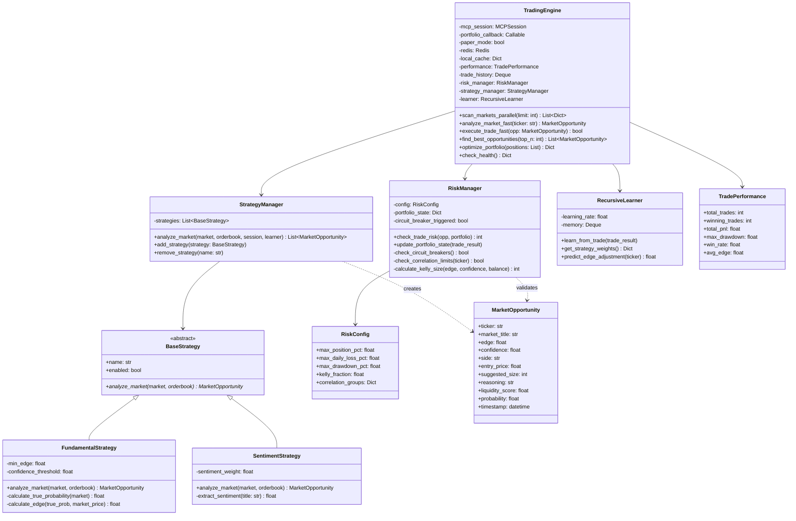
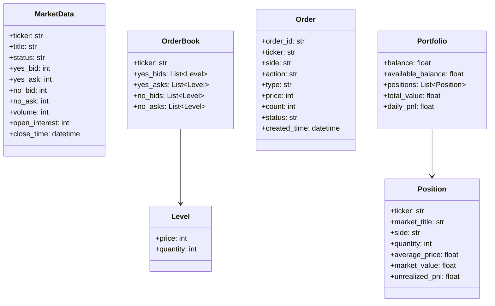
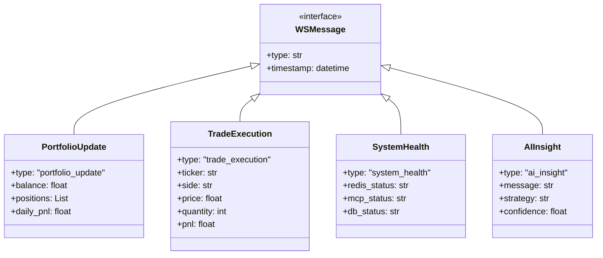

# Class Diagram

> **Last Updated:** 2026-01-26 | **Version:** 4.3.0

## Core Classes

```mermaid
classDiagram
    class TradingEngine {
        -mcp_session: MCPSession
        -portfolio_callback: Callable
        -paper_mode: bool
        -redis: Redis
        -local_cache: Dict
        -performance: TradePerformance
        -trade_history: Deque
        -risk_manager: RiskManager
        -strategy_manager: StrategyManager
        -learner: RecursiveLearner
        +scan_markets_parallel(limit: int) List~Dict~
        +analyze_market_fast(ticker: str) MarketOpportunity
        +execute_trade_fast(opp: MarketOpportunity) bool
        +find_best_opportunities(top_n: int) List~MarketOpportunity~
        +optimize_portfolio(positions: List) Dict
        +check_health() Dict
    }

    class StrategyManager {
        -strategies: List~BaseStrategy~
        +analyze_market(market, orderbook, session, learner) List~MarketOpportunity~
        +add_strategy(strategy: BaseStrategy)
        +remove_strategy(name: str)
    }

    class BaseStrategy {
        <<abstract>>
        +name: str
        +enabled: bool
        +analyze_market(market, orderbook)* MarketOpportunity
    }

    class FundamentalStrategy {
        -min_edge: float
        -confidence_threshold: float
        +analyze_market(market, orderbook) MarketOpportunity
        -calculate_true_probability(market) float
        -calculate_edge(true_prob, market_price) float
    }

    class SentimentStrategy {
        -sentiment_weight: float
        +analyze_market(market, orderbook) MarketOpportunity
        -extract_sentiment(title: str) float
    }

    class RiskManager {
        -config: RiskConfig
        -portfolio_state: Dict
        -circuit_breaker_triggered: bool
        +check_trade_risk(opp, portfolio) int
        +update_portfolio_state(trade_result)
        -check_circuit_breakers() bool
        -check_correlation_limits(ticker) bool
        -calculate_kelly_size(edge, confidence, balance) int
    }

    class RiskConfig {
        +max_position_pct: float
        +max_daily_loss_pct: float
        +max_drawdown_pct: float
        +kelly_fraction: float
        +correlation_groups: Dict
    }

    class RecursiveLearner {
        -learning_rate: float
        -memory: Deque
        +learn_from_trade(trade_result)
        +get_strategy_weights() Dict
        +predict_edge_adjustment(ticker) float
    }

    class MarketOpportunity {
        +ticker: str
        +market_title: str
        +edge: float
        +confidence: float
        +side: str
        +entry_price: float
        +suggested_size: int
        +reasoning: str
        +liquidity_score: float
        +probability: float
        +timestamp: datetime
    }

    class TradePerformance {
        +total_trades: int
        +winning_trades: int
        +total_pnl: float
        +max_drawdown: float
        +win_rate: float
        +avg_edge: float
    }

    TradingEngine --> StrategyManager
    TradingEngine --> RiskManager
    TradingEngine --> RecursiveLearner
    TradingEngine --> TradePerformance

    StrategyManager --> BaseStrategy
    BaseStrategy <|-- FundamentalStrategy
    BaseStrategy <|-- SentimentStrategy

    RiskManager --> RiskConfig
    StrategyManager ..> MarketOpportunity : creates
    RiskManager ..> MarketOpportunity : validates
```

## Data Models

```mermaid
classDiagram
    class MarketData {
        +ticker: str
        +title: str
        +status: str
        +yes_bid: int
        +yes_ask: int
        +no_bid: int
        +no_ask: int
        +volume: int
        +open_interest: int
        +close_time: datetime
    }

    class OrderBook {
        +ticker: str
        +yes_bids: List~Level~
        +yes_asks: List~Level~
        +no_bids: List~Level~
        +no_asks: List~Level~
    }

    class Level {
        +price: int
        +quantity: int
    }

    class Order {
        +order_id: str
        +ticker: str
        +side: str
        +action: str
        +type: str
        +price: int
        +count: int
        +status: str
        +created_time: datetime
    }

    class Position {
        +ticker: str
        +market_title: str
        +side: str
        +quantity: int
        +average_price: float
        +market_value: float
        +unrealized_pnl: float
    }

    class Portfolio {
        +balance: float
        +available_balance: float
        +positions: List~Position~
        +total_value: float
        +daily_pnl: float
    }

    OrderBook --> Level
    Portfolio --> Position
```

## WebSocket Message Types

```mermaid
classDiagram
    class WSMessage {
        <<interface>>
        +type: str
        +timestamp: datetime
    }

    class PortfolioUpdate {
        +type: "portfolio_update"
        +balance: float
        +positions: List
        +daily_pnl: float
    }

    class TradeExecution {
        +type: "trade_execution"
        +ticker: str
        +side: str
        +price: float
        +quantity: int
        +pnl: float
    }

    class SystemHealth {
        +type: "system_health"
        +redis_status: str
        +mcp_status: str
        +db_status: str
    }

    class AIInsight {
        +type: "ai_insight"
        +message: str
        +strategy: str
        +confidence: float
    }

    WSMessage <|-- PortfolioUpdate
    WSMessage <|-- TradeExecution
    WSMessage <|-- SystemHealth
    WSMessage <|-- AIInsight
```
