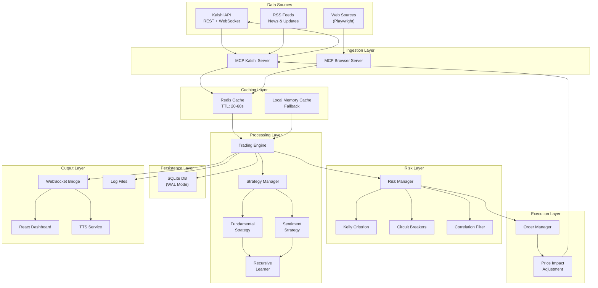
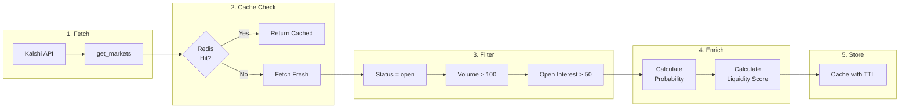
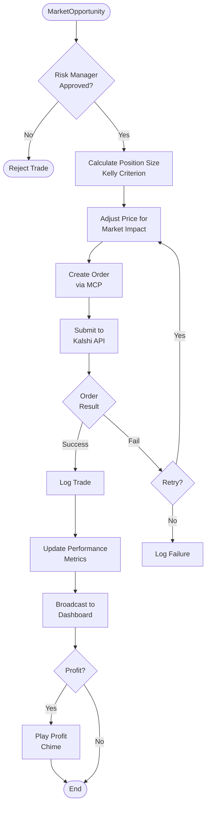
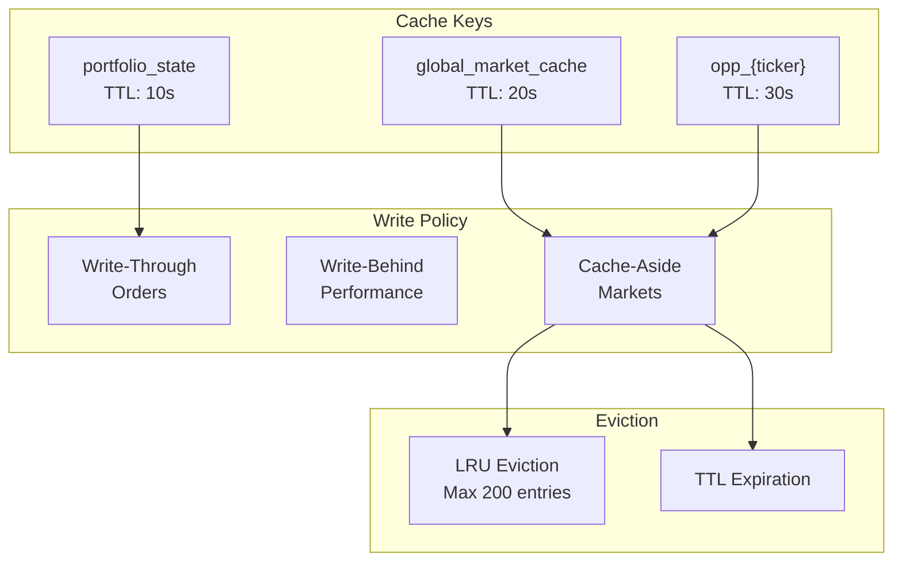

# Data Flow Diagram

> **Last Updated:** 2026-01-26 | **Version:** 4.3.0

## End-to-End Data Flow

## Market Data Pipeline

## Trade Execution Flow

## Cache Strategy

## Data Retention

| Data Type | Storage | Retention |
|-----------|---------|-----------|
| Market Cache | Redis | 20-60 seconds |
| Trade History | SQLite | Permanent |
| Performance Metrics | Memory | Session |
| Logs | Files | 30 days |
| Order Book Snapshots | SQLite | 7 days |
