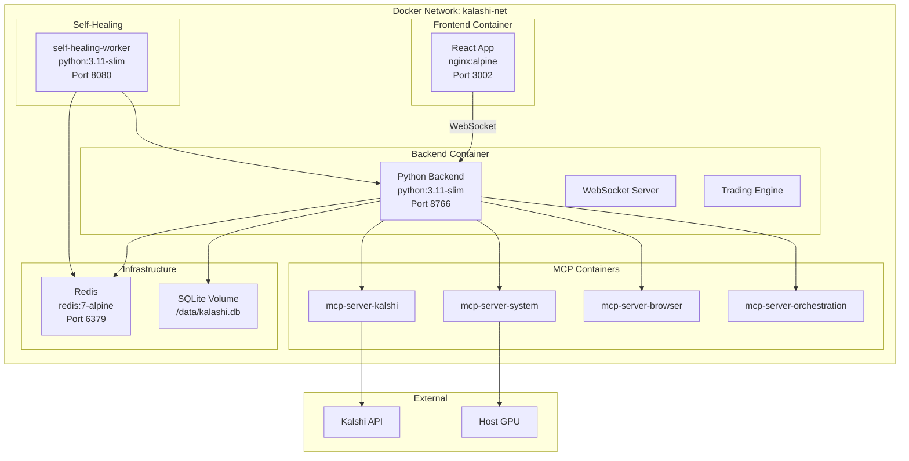
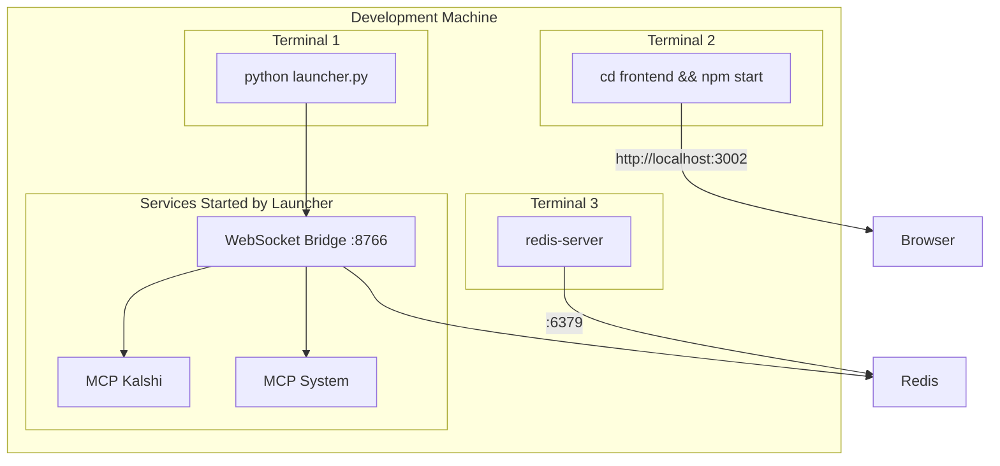

# Deployment Diagram

> **Last Updated:** 2026-01-26 | **Version:** 4.3.0

## Docker Compose Stack



## Docker Compose Services

```yaml
services:
  frontend:
    build: ./frontend
    ports: ["3002:80"]
    depends_on: [backend]

  backend:
    build:
      dockerfile: Dockerfile.backend
    ports: ["8766:8766"]
    environment:
      - REDIS_HOST=redis
      - REDIS_PORT=6379
    volumes:
      - ./data:/app/data
      - ./config:/app/config
    depends_on: [redis]

  redis:
    image: redis:7-alpine
    ports: ["6379:6379"]
    volumes:
      - ./data/redis:/data

  self-healing-worker:
    build: ./self_healing_worker
    ports: ["8080:8080"]
    depends_on: [backend, redis]
```

## Kubernetes Deployment

```mermaid
graph TB
    subgraph "Kubernetes Cluster"
        subgraph "Namespace: kalashi"
            subgraph "Deployments"
                FE["frontend<br/>replicas: 2"]
                BE["backend<br/>replicas: 1"]
                Heal["self-healing<br/>replicas: 1"]
            end

            subgraph "StatefulSets"
                Redis["redis<br/>replicas: 1"]
            end

            subgraph "Services"
                FESvc["frontend-svc<br/>ClusterIP"]
                BESvc["backend-svc<br/>ClusterIP"]
                RedisSvc["redis-svc<br/>ClusterIP"]
            end

            subgraph "Ingress"
                Ingress["kalashi-ingress<br/>nginx"]
            end

            subgraph "ConfigMaps & Secrets"
                CM["kalashi-config"]
                Secret["kalashi-secrets"]
            end

            subgraph "PersistentVolumes"
                PV1["data-pvc<br/>10Gi"]
                PV2["redis-pvc<br/>5Gi"]
            end
        end
    end

    Ingress --> FESvc
    Ingress --> BESvc
    FESvc --> FE
    BESvc --> BE
    BE --> RedisSvc
    RedisSvc --> Redis
    BE --> PV1
    Redis --> PV2
    BE --> CM
    BE --> Secret
```

## Local Development Setup



## Port Assignments

| Service | Port | Protocol |
|---------|------|----------|
| React Dashboard | 3002 | HTTP |
| WebSocket Bridge | 8766 | WebSocket |
| Redis | 6379 | TCP |
| Self-Healing API | 8080 | HTTP |

## Environment Variables

| Variable | Description | Default |
|----------|-------------|---------|
| `REDIS_HOST` | Redis hostname | localhost |
| `REDIS_PORT` | Redis port | 6379 |
| `KALSHI_API_KEY` | Kalshi API key | - |
| `KALSHI_PRIVATE_KEY_PATH` | Path to RSA key | config/kalshi_private.pem |
| `PAPER_MODE` | Enable paper trading | true |
