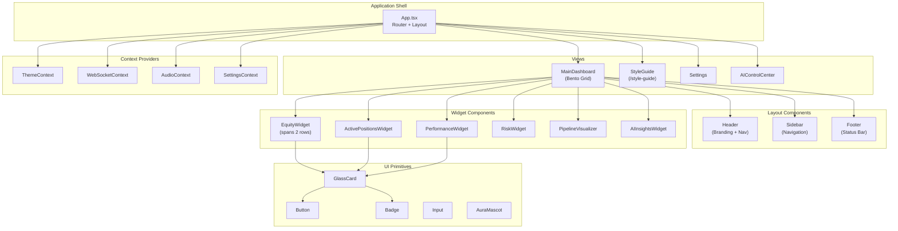
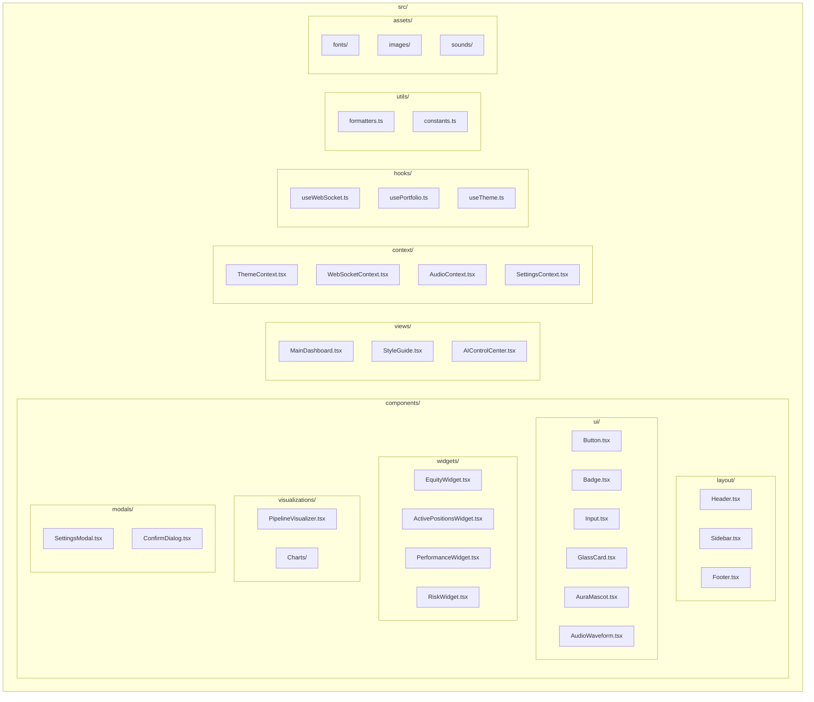
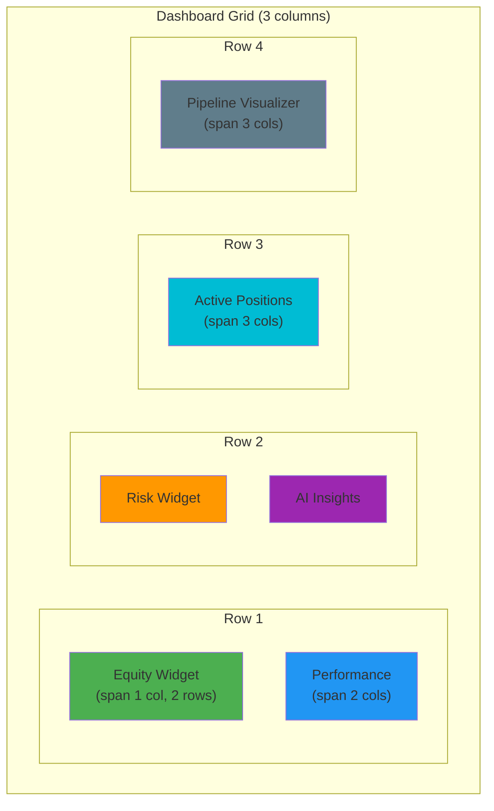
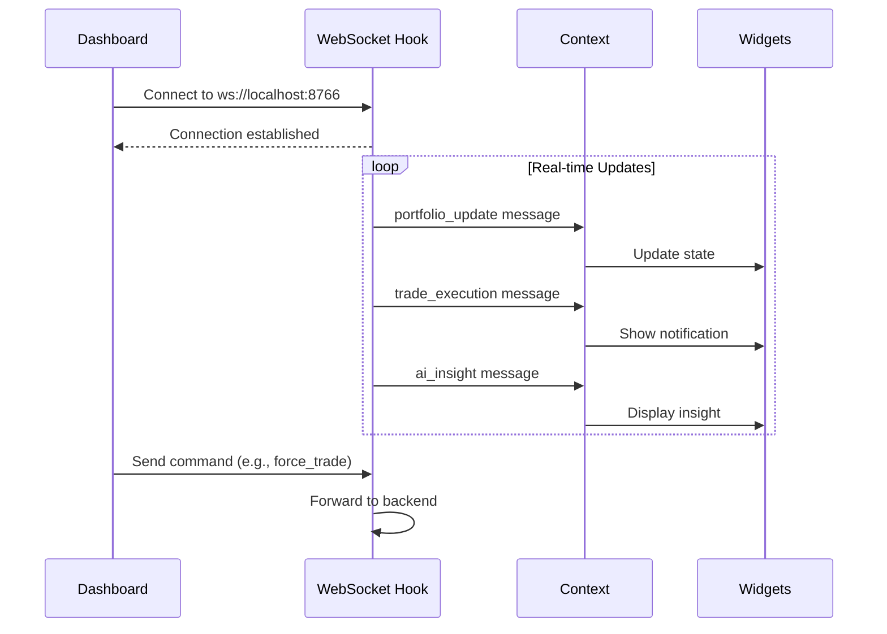
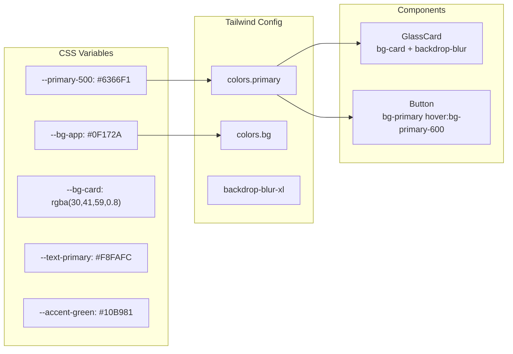
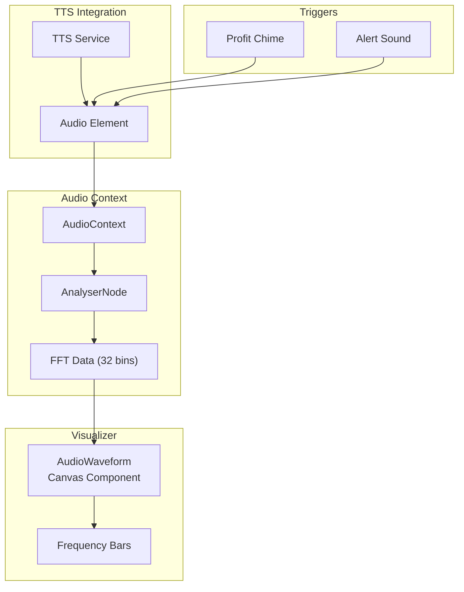

# Frontend Architecture Diagram

> **Last Updated:** 2026-01-26 | **Version:** 4.3.0

## AURA Design System

## Component Hierarchy

## Bento Grid Layout

## WebSocket Data Flow

## Theme System

## Audio System

## Performance Optimizations

| Technique | Implementation |
|-----------|----------------|
| **Code Splitting** | React.lazy for views |
| **Memoization** | useMemo for expensive calculations |
| **Virtualization** | react-window for log lists |
| **Debouncing** | WebSocket message batching |
| **Caching** | SWR for API data |
