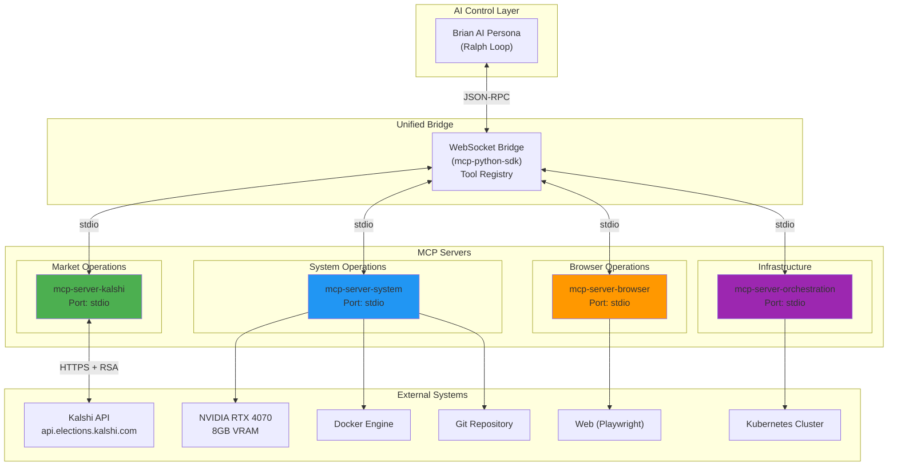
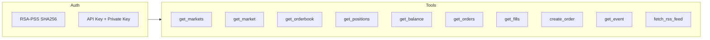
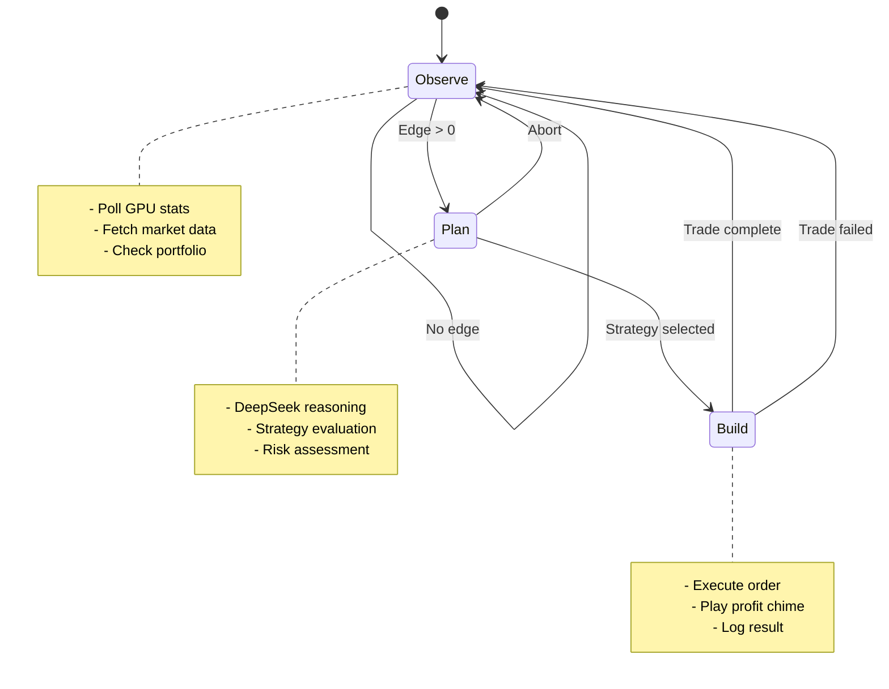

# MCP Server Ecosystem Diagram

> **Last Updated:** 2026-01-26 | **Version:** 4.3.0

## Multi-MCP Architecture

## Tool Registry

### Kalshi MCP Server

| Tool | Description | Rate Limit |
|------|-------------|------------|
| `get_markets` | List active markets | 15/min |
| `get_market` | Single market details | 60/min |
| `get_orderbook` | Order book depth | 60/min |
| `get_positions` | Current holdings | 30/min |
| `get_balance` | Account balance | 30/min |
| `create_order` | Place order | 10/min |
| `fetch_rss_feed` | News & updates | 10/min |

### System MCP Server

| Tool | Description |
|------|-------------|
| `get_gpu_stats` | GPU temp, VRAM usage, utilization |
| `git_operations` | Git status, commit, push |
| `docker_manager` | Container lifecycle management |
| `play_profit_chime` | Audio feedback on profit |

### Browser MCP Server

| Tool | Description |
|------|-------------|
| `browse_and_extract` | Playwright-powered web scraping |

### Orchestration MCP Server

| Tool | Description |
|------|-------------|
| `k8s_manager` | kubectl operations |
| `scale_deployment` | Horizontal scaling |

## Ralph Loop Execution Flow

