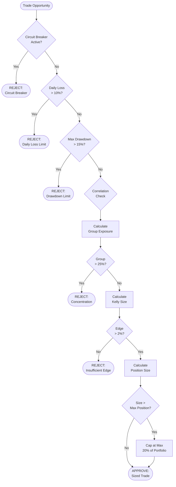
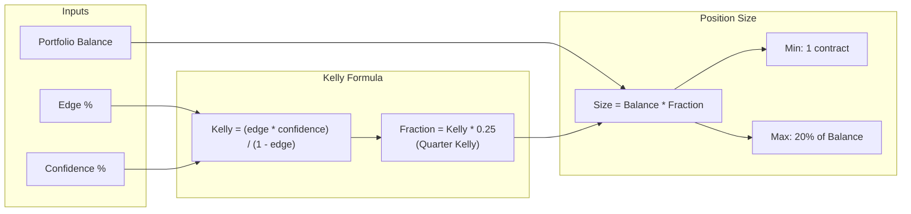
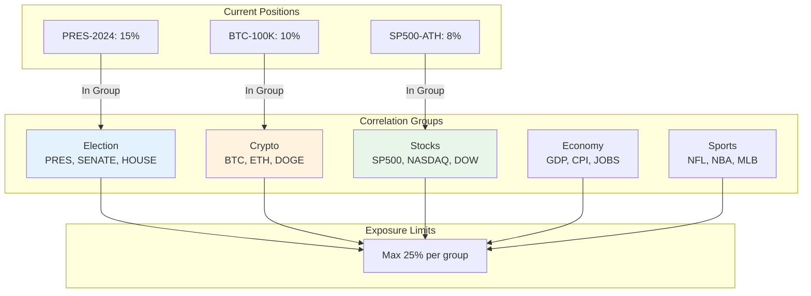
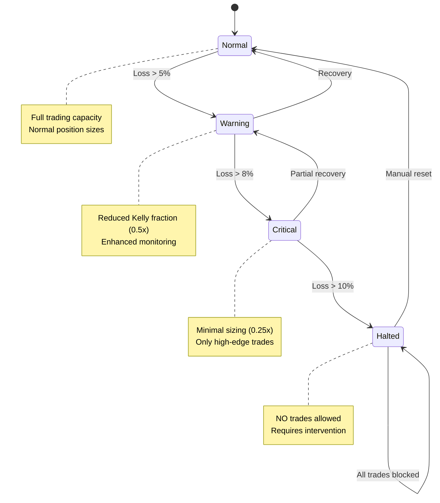
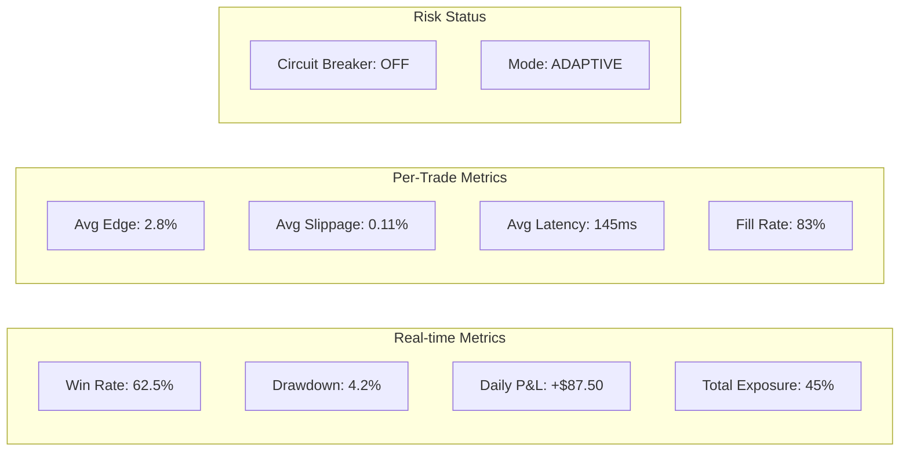

# Risk Management Flow Diagram

> **Last Updated:** 2026-01-26 | **Version:** 4.3.0

## Risk Assessment Pipeline

## Kelly Criterion Calculation

## Correlation Groups

## Circuit Breaker States

## Risk Metrics Dashboard

## Risk Configuration

| Parameter | Default | Description |
|-----------|---------|-------------|
| `max_position_pct` | 20% | Max single position as % of portfolio |
| `max_daily_loss_pct` | 10% | Daily loss circuit breaker |
| `max_drawdown_pct` | 15% | Maximum drawdown allowed |
| `kelly_fraction` | 0.25 | Quarter Kelly for safety |
| `min_edge_threshold` | 2% | Minimum edge to trade |
| `correlation_limit` | 25% | Max exposure per correlation group |
| `max_consecutive_losses` | 5 | Trigger warning state |
