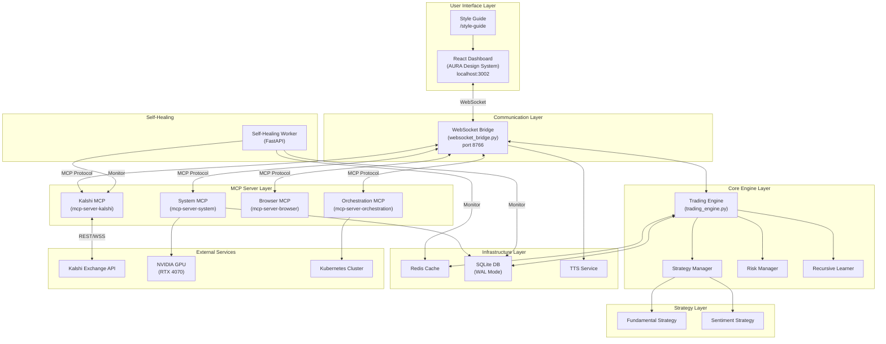

# System Architecture Diagram

> **Last Updated:** 2026-01-26 | **Version:** 4.3.0

## High-Level System Overview

## Component Descriptions

| Component | Technology | Purpose |
|-----------|------------|---------|
| **Dashboard** | React 18 + TypeScript + Tailwind | Bento grid UI with glassmorphism |
| **WebSocket Bridge** | Python asyncio | Real-time communication hub |
| **Trading Engine** | Python + orjson | Market analysis and trade execution |
| **Strategy Manager** | Python | Orchestrates multiple trading strategies |
| **Risk Manager** | Python | Kelly sizing, circuit breakers, correlation limits |
| **MCP Servers** | Python (FastAPI/mcp-sdk) | Tool servers for external integrations |
| **Redis** | Redis 7+ | High-speed caching layer |
| **SQLite** | SQLite3 (WAL) | Persistent data storage |
| **Self-Healing Worker** | Python FastAPI | Infrastructure health monitoring |

## Data Flow

1. **User Interaction** → Dashboard sends commands via WebSocket
2. **Bridge Processing** → WebSocket Bridge routes to Trading Engine
3. **Market Analysis** → Engine scans markets via MCP → Kalshi API
4. **Strategy Evaluation** → Strategy Manager aggregates signals
5. **Risk Assessment** → Risk Manager validates and sizes positions
6. **Execution** → Orders placed via MCP → Kalshi Exchange
7. **Feedback Loop** → Results broadcast to Dashboard
