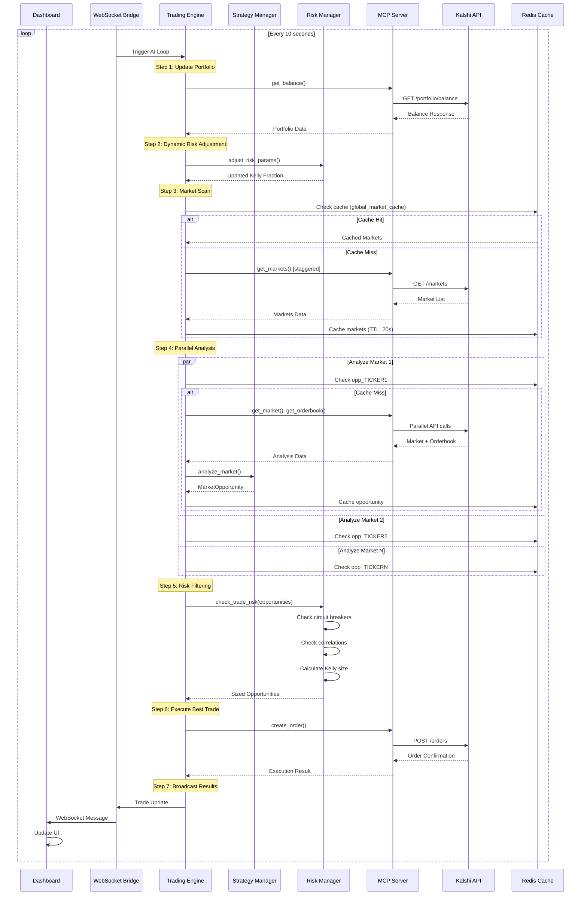
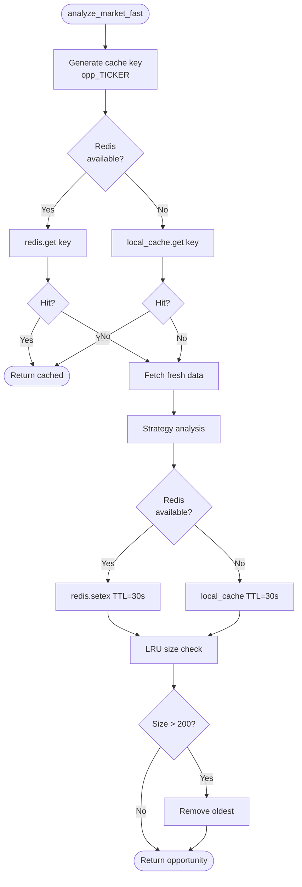

# Trading Loop Sequence Diagram

> **Last Updated:** 2026-01-26 | **Version:** 4.3.0

## AI Trading Loop (10-second intervals)

## Cache Flow Detail

## Trading Loop Metrics

| Step | Target Latency | Actual |
|------|----------------|--------|
| Portfolio Update | 50ms | ~30-40ms |
| Market Scan (cached) | 1ms | <1ms |
| Market Scan (fresh) | 500ms | ~300-500ms |
| Single Market Analysis | 100ms | ~50-80ms |
| Risk Check | 5ms | <2ms |
| Order Execution | 150ms | ~100-150ms |
| **Total Loop** | **10s** | **10s** |
